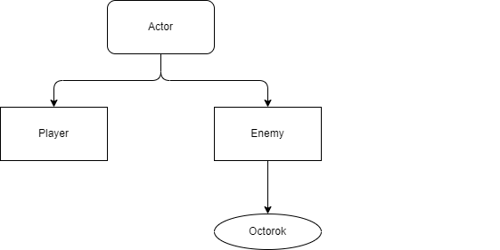
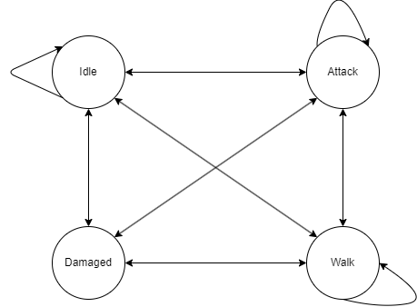
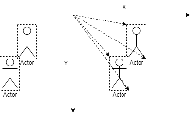

# Zelda-NES

## Concept

In this repository, we developed a simplified version of "The Legend of Zelda" for the NES, where:
- the player already has a sword equiped;
- there is only 1 type of enemy;
- the map is cut in more then half;
- the only playable are is the overworld;

## Patterns used:

### Command

We implemented the Command pattern to split the actions by key presses. While certain keys will lead to events, such as `walk` or `attack`, if no key is pressed, or the key is not included, we will get `idle`.

###  Event Queue

Key presses are seen as events, they are stored in an Event Queue, where the most recent adition takes priority. This is done to have more fluid movement.

###  Component 

To split the game from the display we have `display_loader` do deal with both the display of hub and the map, as well as `player_sprite` to deal with the player's sprites

###  Inheritance, Prototype

The game will have entities that will move around and interact with each other, `Player` and `Enemy`, they both derive from the same class of `Actor`. \
We have also prepared `Enemy` in a way that it will be the base for all the differente types of enemies. We devoloped the enemy `Octorok`.

###  Service locator

To spawn enemies in the map, we search for specificly coloured pixels when the map is changed and spawn enemies in those positions.

###  Finite state machine

We created transition states so we can pass from one state to another and using the finite state machine we update the action needed.

###  Observer

To replicate the combat, we utilize an observer to keep track of the actors hitboxes, check if they overlap and notify them when they were hit. \
To define the hitboxes, we utilized Broad Phase Axis-Aligned Bounding Box, with the top left and bottom right coners defining the hitbox.

## How to run

Download repository \
\$ cd Zelda \
\$ python3 main.py